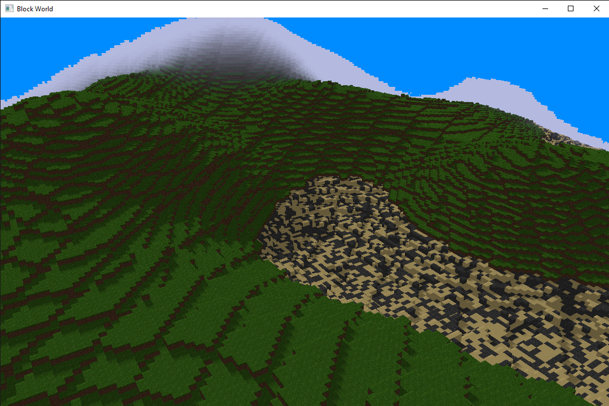

# BlockWorld
Block World development moved to a new repo and a new build system, compatible with Linux!

The current goal is to get development on Block World so that non-Windows friends can also try it out, and make some deep revisions to the original program structure for long-term sustainability.

## How To Build
The current implementation requires a CPU with AVX2 instruction set support minimum.
1. Make a new directory and cd into the new directory.
   ```bash
   > mkdir BlockWorld && cd BlockWorld
   ```
2. Clone the repository inside the folder.
   ```bash
   > git clone https://github.com/AJQuattropani/block-world.git
   ```
3. Make and move into a build directory, and build project. For building at the same location as the repo:
   ```bash
   > mkdir build && cd build
   > cmake ../block-world
   > cmake --build .
   ```
4. Run the output executable. You should get a window.
   ```bash
   > ./BlockWorld
   ```
# About

Block World is in in-dev project that uses OpenGL/C++ and modern parallel processing techniques to produce a resource-efficient voxel engine, inspired by Minecraft.
It is a basic sandbox, with the ability to place and break blocks, a day/night cycle, and a procedurally-generated landscape.


## Performance Techniques
The main purpose of this project was to advance my knowledge of high-performance C++ and parallel programming on the GPU and CPU. Features implemented thus far include:
1. Multithreading via threadpool
2. SIMD instrinsics (AVX2)
3. Binary-meshing system
4. Geometry shaders




## Future Projects:
- Loading a world from file
- Entities
- Transparent blocks
- Collision Physics and Gravity
- Improved controls
- Gameplay
- Biomes


